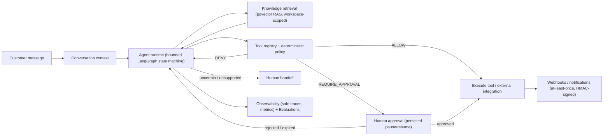

# SupportPilot AI

A production-oriented, agentic customer-operations platform. It resolves
support requests by retrieving business context and knowledge, selecting
approved tools, enforcing deterministic policy, executing bounded actions,
requesting human approval for risky actions, escalating to a human when
uncertain, and preserving structured execution traces and immutable audit
history — never a hidden chain-of-thought.

## Problem

Support teams that want to let an LLM act — issue a refund, book an
appointment, update a ticket — face the same three risks every time: the
model can be wrong, it can be manipulated by the content it retrieves
(prompt injection via a knowledge chunk or a customer message), and its
actions need to be auditable and reversible-in-decision even when its
words aren't. Most "AI agent" demos skip straight past this and let the
model call tools directly.

## Solution

SupportPilot AI puts a deterministic boundary between "the model proposes"
and "the system executes." Every tool call goes through a typed registry,
a policy engine that evaluates risk from server-owned rules (never the
model's own judgment), and — for high-risk actions — a persistent human
approval step that the agent run pauses for and safely resumes from.
Retrieved knowledge is always treated as untrusted data, never as
instructions. Every step of a run is captured as a structured, safe trace
(intent, retrieval IDs/scores, selected tool, redacted arguments, policy
result, approval result, latency/cost) — enough to reconstruct and audit
what happened, without ever persisting the model's raw reasoning.

## Architecture

```text
React/TypeScript (Next.js) frontend
        |
        v
Django/DRF modular monolith
        |
        +--> PostgreSQL + pgvector   (sole durable business store)
        +--> Redis / Celery          (cache, broker, result backend — never authoritative)
        +--> AI provider interfaces  (deterministic fake by default; real OpenAI adapter opt-in)
        +--> typed tool registry     (schema-validated, risk-scored, idempotent)
        +--> business integrations  (Stripe, Google Calendar, email — provider-independent)
        +--> policy / approval engine
        +--> observability / evaluation
```



See [docs/architecture/full-agent-orchestration.md](docs/architecture/full-agent-orchestration.md)
for the detailed per-run state machine (policy gate, approval pause/resume,
handoff outcomes), and the full [docs/architecture/](docs/architecture/) and
[docs/adr/](docs/adr/) directories for every subsystem.

## Key features

| Domain | What's real |
|---|---|
| Auth | Email/password, JWT access token (in-memory only, never persisted client-side) + HttpOnly rotating refresh cookie, CSRF-enforced |
| Workspaces / RBAC | Five roles (`owner, admin, support_manager, support_agent, viewer`), DB-enforced single-owner-per-workspace, server-derived permissions on every request (never trusted from a token claim) |
| Customers, Conversations, Tickets | Core support-operations data model, workspace-scoped throughout |
| Knowledge / RAG | PostgreSQL + pgvector retrieval, citations returned, workspace-scoped, retrieved text always treated as untrusted |
| Agent Runs | Bounded LangGraph-style state machine — explicit max model/tool calls, wall time, token/cost budgets; deterministic fake LLM provider by default, real OpenAI adapter opt-in |
| Tool Executions | Central typed registry: schema-validated I/O, risk level, timeout, retry/idempotency policy, redacted sensitive fields |
| Approvals | Persisted human-in-the-loop pause/resume for high-risk actions; self-approval and role-insufficiency blocked server-side |
| Human Handoffs | Deterministic escalation with categorical reason codes (never a fabricated "confidence score") |
| Integrations | Stripe (test-mode), Google Calendar, email — provider-independent adapters behind typed interfaces, encrypted credentials at rest, owner/admin-only |
| Webhooks | HMAC-SHA256-signed outbound delivery, durable **at-least-once** (never claimed exactly-once), SSRF-safe pinned-IP transport, manual redrive |
| Evaluations | Deterministic golden datasets, batch runs, replay, backend-computed pass/fail and metric deltas — no invented quality/confidence score anywhere |
| Observability / Audit | Structured safe traces and immutable audit events — never hidden chain-of-thought; `/metrics/` is Prometheus infra, not a tenant API |

## AI / RAG workflow

A customer message enters an `AgentRun`. The runtime assembles bounded
conversation context, retrieves workspace-scoped knowledge chunks via
pgvector similarity search (with citations), and calls the configured LLM
provider. The model can produce a final answer, request a tool, or request
a handoff. A tool request goes through the typed registry and the
deterministic policy engine before anything executes — the model's own
judgment never decides whether an action is safe. Low-confidence retrieval
is designed to abstain/hand off rather than let the model hallucinate an
answer from nothing.

## Tool / approval safety

Every tool has a declared risk level and required capability. The policy
engine evaluates each call against workspace-scoped, versioned rules and
returns `ALLOW`, `DENY`, or `REQUIRE_APPROVAL` — deterministically, from
data, never from the model. A `REQUIRE_APPROVAL` result persists the run
in a genuine paused state; a real human decision (with self-approval and
insufficient-role attempts rejected server-side) resumes the exact same
run. Repeated identical approval decisions are idempotent; a conflicting
decision on an already-resolved approval is rejected.

## Integrations & webhooks

Business integrations (Stripe, Google Calendar, email) sit behind
provider-independent interfaces with encrypted per-workspace credentials,
reachable only through the typed tool boundary — never a bare outbound
HTTP call from agent code. Outbound webhooks are HMAC-signed and delivered
**at-least-once** with a stable idempotency identity; a receiver can
safely treat a duplicate delivery as a no-op. There is no delete endpoint
for webhook endpoints by design (disable/rotate only) and no claim of
exactly-once delivery anywhere in the system.

## Evaluation framework

Evaluation datasets and cases are real, versioned records. A run executes
each case against a published agent version and produces backend-computed
`scorer_output` and pass/fail verdicts — the frontend never invents a
quality score, a confidence percentage, or an "% improvement" figure; it
renders exactly what the backend computed, including regressions.
Historical run snapshots are immutable from later edits to the live
dataset/case, so a past comparison never silently drifts.

## Multi-tenancy / RBAC

Every workspace-scoped query enforces tenant scope before object
resolution; cross-tenant access returns not-found, never a 403 that would
leak existence. Server-side RBAC is authoritative — the frontend never
decides what a role can do, it only reflects what the backend already
enforces. Five roles (`owner, admin, support_manager, support_agent,
viewer`) cover every domain from customer data to workspace settings.

## Quick start

### Prerequisites

- Docker Desktop
- Python 3.11+
- Node.js 20+

### Local development

```bash
# Backend
cd backend
python -m venv venv
source venv/bin/activate       # Windows: venv\Scripts\activate
pip install -e ".[dev]"

# Start Postgres/Redis (dev stack — bind-mounted source, DEBUG=True)
cd ..
docker compose up -d db redis

cd backend
python manage.py migrate
python manage.py runserver

# In another terminal — Celery worker (needed for knowledge ingestion,
# agent runs, evaluations, webhooks, notifications)
celery -A config worker -l info

# In another terminal — frontend
cd frontend
npm install
npm run dev
```

Access: API at `http://localhost:8000/api/v1/`, frontend at
`http://localhost:3000`, Django admin at `http://localhost:8000/admin/`,
health/readiness at `/health/` and `/ready/`, OpenAPI schema at
`/api/v1/schema/` (interactive Swagger UI at `/api/v1/schema/swagger-ui/`).

### Demo data

```bash
cd backend
SUPPORTPILOT_DEMO_PASSWORD='choose-a-local-password' python manage.py seed_demo
```

Deterministic, idempotent, and synthetic-only — no live provider calls,
safe to re-run. Creates two workspaces, five demo users across every role
(`owner.acme@example.com`, `admin.acme@example.com`,
`agent.acme@example.com`, `viewer.acme@example.com`,
`owner.nimbus@example.com`, all with the password you set), customers,
conversations, tickets, a ready knowledge document, an evaluation run, and
one real webchat-originated conversation. Run it only with a Celery worker
already up — the webchat item is processed asynchronously and the
command's own printed summary can undercount by one customer/conversation
if it prints before that task completes; re-running is harmless and safe.

### Production-like stack

```bash
cp .env.production.example .env.production   # fill in real values; never commit this file
docker compose -p supportpilot-prod --env-file .env.production -f docker-compose.prod.yml build
docker compose -p supportpilot-prod --env-file .env.production -f docker-compose.prod.yml up -d db redis
docker compose -p supportpilot-prod --env-file .env.production -f docker-compose.prod.yml run --rm migrate
docker compose -p supportpilot-prod --env-file .env.production -f docker-compose.prod.yml up -d web worker beat
```

Full runbook, health/readiness contract, backup/restore, rollback
limitations, and graceful-shutdown behavior — all verified against a real
Docker stack — in
[docs/operations/deployment.md](docs/operations/deployment.md).

## Demo journey

After `seed_demo`, sign in as `owner.acme@example.com` (workspace "Acme
Retail Support") and follow one real, end-to-end path through the product:

1. **Inbox** — open conversation "A" (open, web channel) and read its
   messages.
2. **Agent Runs** — open the linked agent run and step through its trace:
   retrieval hits with citations, the tool it selected, the policy result.
3. **Approvals** — the seeded pending approval shows a paused run waiting
   on a real human decision; approve or reject it and watch the run
   resume.
4. **Knowledge** — the seeded "Support Policies" source has two ready
   documents; run a retrieval search and see citations come back.
5. **Handoffs** — the seeded handoff shows a deterministic escalation
   reason, not a fabricated confidence score.
6. **Integrations / Webhooks** — inspect the three seeded integration
   connections and, if a webhook endpoint is configured, its delivery
   history (real HMAC signing, at-least-once semantics, manual redrive).
7. **Evaluations** — open the "Support Regression Suite" dataset's
   succeeded run and its backend-computed pass/fail results.
8. **Settings** — as `owner.acme@example.com`, review members/roles; sign
   in again as `viewer.acme@example.com` to see the same screens
   read-only, enforced server-side.

## Project structure

```text
SupportPilot AI/
├── backend/                 # Django/DRF API
│   ├── config/              # Settings, URLs, Celery app, Gunicorn config
│   ├── accounts/            # Authentication
│   ├── workspaces/          # Tenancy + RBAC
│   ├── customers/ conversations/ tickets/
│   ├── knowledge/           # RAG ingestion + retrieval
│   ├── agents/              # Agent runtime + tool bindings
│   ├── tools/                # Typed tool registry + execution
│   ├── policies/ approvals/  # Deterministic policy + human approval
│   ├── integrations/        # Stripe / Calendar / email adapters
│   ├── webhooks/ notifications/ channel_ingress/
│   ├── evaluations/          # Golden-case evaluation framework
│   ├── observability/ audit/ health/
│   ├── Dockerfile  entrypoint.sh  pyproject.toml
├── frontend/                 # Next.js / React / TypeScript (strict)
│   ├── src/{app,features,components,lib}
│   ├── e2e/                  # Playwright specs (real backend, no mocks)
│   ├── openapi.yaml           # Generated contract (drift-checked against the backend)
│   └── playwright.config.ts  next.config.ts  vitest.config.mts
├── docs/{architecture,adr,api,operations,security,observability,reliability}/
├── docker-compose.yml         # Development stack
├── docker-compose.prod.yml    # Production-like stack
├── .env.example  .env.production.example
└── README.md
```

## Testing

Verified full-suite results (see each report for exact conditions):

| Suite | Result |
|---|---|
| Frontend unit/component (Vitest) | 631/631 passed |
| Frontend E2E (Playwright, real backend, run twice consecutively) | 376/377 passed, 0 failed, 1 accepted `test.fixme` (documented rare navigation-churn edge) |
| Backend (pytest, Docker/Linux) | 2485/2495 passed; the other 10 are pre-existing meta-tests that check repo-root docs/deploy files excluded from the backend-only Docker build context, not product code |
| Backend coverage | 96.63% (target ≥95%) |
| OpenAPI contract drift | 133 backend operations / 133 generated / 0 drift |
| Accessibility (axe, full route sweep) | 0 critical, 0 serious |
| Responsive (375/768/1280/1440px) | No horizontal overflow on any tested surface |

```bash
# Backend
cd backend
pytest --cov --cov-report=term-missing

# Frontend
cd frontend
npm run test        # Vitest
npm run e2e          # Playwright (starts its own backend + production frontend build)
```

## Security

Tenant isolation enforced server-side on every workspace-scoped query;
cross-tenant access returns not-found. Access tokens live in memory only
(never localStorage/sessionStorage/a URL). Integration credentials and
webhook signing secrets are encrypted at rest and reveal-once on
creation/rotation — never returned again by the API. Outbound webhook
transport is SSRF-hardened (pinned-IP, no redirect-following, public
destinations only). See
[docs/security/threat-model.md](docs/security/threat-model.md),
[docs/security/authentication-tenancy-rbac.md](docs/security/authentication-tenancy-rbac.md),
and the webhook security docs for the full detail.

## Known limitations

- Single-host deployment topology: one PostgreSQL instance, one Redis
  instance, one intended Celery Beat scheduler — not high availability.
- Celery's default `acks_late=False` means a hard worker crash mid-task is
  not broker-redelivered; durability for the cases that matter comes from
  dedicated stuck-run recovery sweepers, not from Celery redelivery.
- No reverse proxy/TLS terminator is packaged here — a real deployment
  needs an operator-managed one in front of the `web` process.
- Backend dependency versions are exactly pinned for direct dependencies,
  but there is no lock file, so transitive dependency versions float on
  each fresh install.
- No tenant-facing trace/span explorer UI, no Notifications UI (no public
  API for it yet), no OAuth/SSO, no billing.
- One accepted E2E `test.fixme` for a rare navigation-churn edge case not
  observed in normal interaction (`PHASE22-3-04`).

## License

Proprietary — SupportPilot AI
