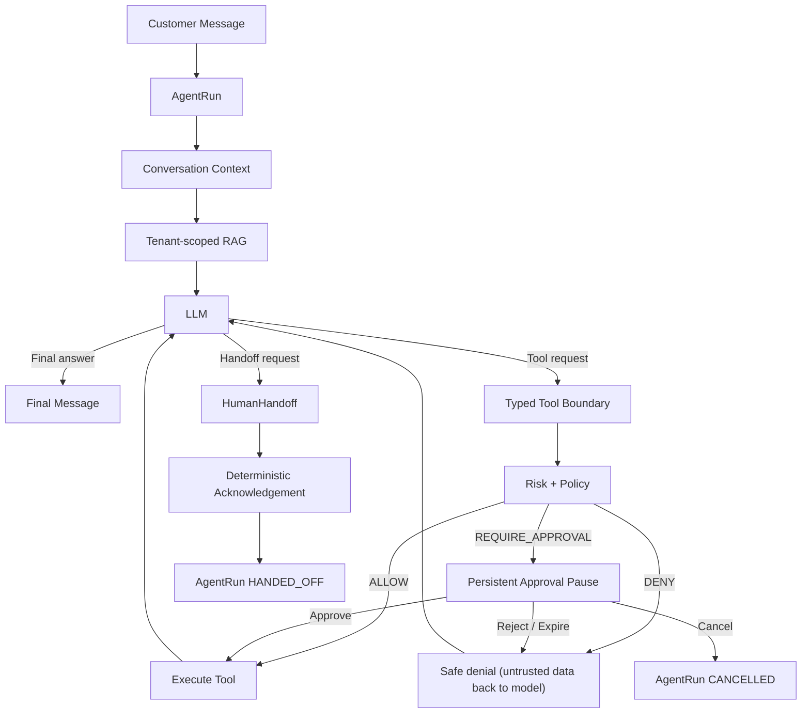

# Full agent orchestration

Phase 9 assembles every layer built in Phases 5-8 — the bounded LangGraph
runtime, the typed tool boundary, business integrations, and the
deterministic policy/approval engine — into one coherent orchestration
service that can carry a real customer conversation from an inbound message
to a final response, with three possible terminal outcomes: an autonomous
answer, an approval-gated action, or a human handoff. It also adds the
pieces those prior phases assumed but didn't yet build: conversation
history as model context, tenant-scoped RAG, a bounded multi-turn
tool-then-continue loop, and deterministic failure/recovery classification.

This document describes the final, assembled system. The block-by-block
design rationale for each layer lives in its own architecture doc, linked
from the relevant section below; this document is the map, not a
replacement for them.

## Purpose

Turn one customer message into one of exactly three outcomes:

1. **Can safely complete** → a final, customer-facing `Message`, no tool
   side effects beyond what policy already allowed.
2. **Needs authorized action** → a policy-gated tool call, executed only
   after an `ALLOW` decision or a real human `ApprovalDecision`.
3. **Cannot or should not safely complete** → a `HumanHandoff`, with a
   deterministic acknowledgement and no further autonomous execution for
   that conversation.

Nothing else. The model never gets a fourth option, and nothing it says
changes *which* of these three outcomes it's structurally allowed to reach.

## Domain boundaries

```text
agents        — AgentRun/AgentVersion, orchestration, runtime graph, RAG,
                conversation context, failure classification
conversations — Conversation/Message identity, AI-agent message persistence
knowledge     — pgvector-backed retrieval, workspace-scoped chunks
tools         — typed registry, execution boundary, idempotency
integrations  — provider-independent business adapters (Stripe, Calendar, email)
policies      — versioned rules, deterministic risk/policy evaluation
approvals     — pause/resume lifecycle, RBAC decisions
tickets       — HumanHandoff domain, ticket linkage
audit         — immutable, read-only structured event log
```

Each app owns its own models and services; `agents` is the only app that
calls across all of them, and it does so through their public service/
selector functions — never by reaching into another app's ORM internals.

## Final orchestration flow



Handoff is reachable directly from the LLM's response (an explicit or
model-judged escalation) or indirectly, as the deterministic outcome of a
classified retryable-provider-exhaustion failure — see
[Failure classification](#failure-classification) below. It is never
reachable from a policy `DENY` or an `ApprovalRequest` rejection/expiry —
those are safe, informative outcomes the model is expected to explain to
the customer, not automatic escalations.

## Trigger-message idempotency

`AgentRun.trigger_message` is a `OneToOneField`. `start_support_agent_run`
validates the message is a real, inbound, non-empty customer turn on the
target conversation (never trusting a client-supplied ID's *meaning*, only
its identity) and either creates a new `AgentRun` or returns the one that
already exists for that message — so a redelivered "customer sent this
message" event can never spawn two runs.
See [agent-runtime-foundation.md](agent-runtime-foundation.md) and
[conversation-context-and-rag.md](conversation-context-and-rag.md).

## Conversation context

`agents/context.py` builds a bounded, role-normalized transcript
(`AGENTS_CONTEXT_MAX_MESSAGES` / `AGENTS_CONTEXT_MAX_CHARACTERS`) ending
with the trigger message exactly once, truncating oldest-first when the
conversation is long. History is customer-visible content only — never
another workspace's messages, never internal staff notes.

## RAG

`agents/rag.py` retrieves from the workspace's own pgvector-backed
knowledge chunks only (`AGENTS_RAG_TOP_K` / `AGENTS_RAG_MAX_CHARACTERS`),
returns real citation metadata (chunk id, document id, score) alongside the
text, and abstains (empty result set, not a fabricated answer) rather than
guessing when nothing relevant exists. A retrieval failure fails the run
safely — it never falls back to answering from the model's own unsourced
knowledge. See
[knowledge-rag-foundation.md](knowledge-rag-foundation.md) and
[conversation-context-and-rag.md](conversation-context-and-rag.md).

## Citations

Only chunks the retrieval service actually returned are ever recorded as
citations on a step or surfaced in trace metadata. A model claiming a
source it was never given, or a tool result embedding a fake source ID,
never becomes a trusted citation — the citation list is server-populated
before the LLM call, not parsed back out of the LLM's response.

## Tool orchestration

`agents/tool_catalog.py` resolves the *bound, enabled* tools for the
run's `AgentVersion` into safe `ToolDescriptor`s (name, description, JSON
schema — never a handler reference or credential) before every model call,
so a disabled or unbound tool is invisible to the provider request, not
merely rejected after the fact. `agents/runtime/graph.py` executes at most
one tool call per model turn (any additional calls in the same response are
recorded as ignored, never executed or queued) and feeds the result back as
explicitly delimited, untrusted data — "TOOL RESULT — UNTRUSTED EXTERNAL
DATA … END TOOL RESULT" — so a prompt-injection payload embedded in a tool
result carries no more authority than the RAG or customer-message case. See
[bounded-tool-orchestration.md](bounded-tool-orchestration.md) and
[typed-tool-execution.md](typed-tool-execution.md).

## Risk / policy

Every tool call passes through the same `tools.execution.execute_tool` gate
regardless of caller — there is no second, policy-free entry point. Exactly
three decisions: `ALLOW`, `DENY`, `REQUIRE_APPROVAL`, fixed precedence
`DENY > REQUIRE_APPROVAL > ALLOW`, fail-closed on any evaluation error. See
[policy-approval-engine.md](policy-approval-engine.md).

## Approval pause/resume/reject/expire/cancel

A `REQUIRE_APPROVAL` decision pauses the `AgentRun` in
`WAITING_FOR_APPROVAL` — a non-terminal, non-busy-waiting state; nothing
holds a worker thread, Celery task, or DB transaction open while a run sits
there. `ApprovalDecision` is a `OneToOneField` on `ApprovalRequest`: exactly
one final decision, ever. Approve resumes the *same* `AgentRun`, the *same*
`AgentVersion`, and executes the *same* frozen action (the tool's
already-validated, already-fingerprinted argument snapshot — never a fresh
argument an attacker could substitute); reject and expiry both continue the
run with a safe denial the model can explain, never a handler call; cancel
races approval under the same `select_for_update`+status-guard pattern used
throughout the run's lifecycle, so a cancellation that wins never lets a
provider call slip through afterward. See
[approval-resume-continuations.md](approval-resume-continuations.md).

## Human handoff

`HumanHandoff` is a distinct, typed field on the LLM response
(`NormalizedHandoffRequest`) — not a tool — so an explicit or model-judged
escalation never creates a `ToolExecution` row and takes precedence over
any tool call proposed in the same turn. The model supplies only a
`reason_code` (validated against the server-owned `HumanHandoffReason`
enum) and a `summary`; it has no field through which to choose a workspace,
assignee, RBAC role, or ticket. Handoff creation and the `AgentRun`'s
transition to `HANDED_OFF` happen atomically, reusing
`HumanHandoff`'s partial-unique "one active handoff per conversation"
constraint for idempotent create-or-reuse, and the acknowledgement message
reuses the same `output_message` `OneToOneField` invariant an ordinary
successful completion uses — one acknowledgement, no extra LLM call. A
conversation with an active handoff short-circuits a new autonomous run
before any RAG/LLM cost. See
[human-handoff-orchestration.md](human-handoff-orchestration.md).

## Failure classification

`agents/failure_classification.py` is a single, reviewable table: a
retryable provider failure (`provider_rate_limited`,
`provider_timeout`, `provider_temporarily_unavailable`) that exhausts its
retry budget on a run *with* a conversation becomes a `HANDOFF`; every
other terminal failure — configuration, authentication, a run with no
conversation to hand off to, or an ordinary safe business-tool failure the
model can already explain to the customer — stays `FAILED`. Handoff can
never become a generic exception catch-all, and an infrastructure failure
can never masquerade as a customer escalation.

## Budgets

`max_model_calls`, `max_tool_calls`, `max_steps`, a token ceiling, and a
wall-time limit are immutable per `AgentVersion` and enforced before every
model/tool call — never derived from client input. Approval resume and a
handoff completion both continue the run's own persisted counters; neither
resets a budget, and a handoff never spends an extra model call to
formulate its acknowledgement.

## State machine

```text
PENDING → RUNNING → SUCCEEDED
                   → FAILED
                   → CANCELLED
                   → BUDGET_EXCEEDED
                   → HANDED_OFF
                   → WAITING_FOR_APPROVAL → RUNNING → (any terminal state above)
                                          → CANCELLED
```

`SUCCEEDED`, `FAILED`, `CANCELLED`, `BUDGET_EXCEEDED`, and `HANDED_OFF` are
all terminal: every terminal-writing service function re-checks
`status == RUNNING` (or `WAITING_FOR_APPROVAL`, for the approval-specific
transitions) under `select_for_update()` before writing, so none of them
can be reopened by a redelivered task, a racing worker, or a stale approval
decision. `WAITING_FOR_APPROVAL` is the one non-terminal pause state.

## Idempotency

| Invariant | Enforcement |
| --- | --- |
| One `AgentRun` per trigger message | DB — `OneToOneField` |
| One output `Message` per `AgentRun` | DB — `OneToOneField` |
| One active `HumanHandoff` per conversation | DB — partial unique constraint |
| One final `ApprovalDecision` per `ApprovalRequest` | DB — `OneToOneField` |
| One logical `ToolExecution` per (workspace, tool, idempotency key, argument fingerprint) | DB — unique constraint (Phase 6) |
| Provider-level side-effect idempotency (refund, booking) | Service-enforced — provider idempotency keys/lookups (Phase 7) |
| Claim/resume/cancel/complete races | Service-enforced — `select_for_update()` + status guard inside `transaction.atomic()` |

The first four are durable DB constraints because they describe facts that
must never have two answers, independent of application code correctness.
The last three are service-enforced because they depend on external
provider semantics or on a status transition that is itself the thing
being guarded.

## Concurrency

Every race a production deployment can actually produce — duplicate task
delivery, two workers claiming the same run, two approvers clicking at
once, an approval racing a cancellation, two workers completing the same
handoff — is exercised with real threads against real PostgreSQL row locks
in `agents/tests/test_orchestration_hardening.py` and
`approvals/tests/test_services.py::TestConcurrency`, not simulated with
sequential replay alone. See
[block6-hardening-matrix.md](block6-hardening-matrix.md) for the full
scenario-to-test mapping.

## Security / trust boundaries

**Untrusted at every layer:** the customer's message, conversation history,
RAG chunks, the LLM's own output, tool/provider results, approval
comments, any ID a client supplies, and Celery delivery timing/count.

**Trusted authority comes only from:** workspace-scoped DB queries, live
RBAC membership (re-read at decision time, never cached), the run's
immutable `AgentVersion`, its `ToolBinding`s, the code-owned
`ToolRegistry`, typed/schema validation, the deterministic risk/policy
evaluator, a persisted `ApprovalDecision`, the server-owned execution
context assembled from the run's own trusted fields, and DB constraints.

No hidden reasoning is ever persisted. The safe operational trace records
intent, retrieval IDs/scores, selected tool, redacted arguments, policy
result, approval result, provider metadata, latency, token usage, cost
estimate, error code, and the final user-visible response — never a
chain-of-thought, scratchpad, or private-reasoning field; none exists on
any Phase 9 model or provider contract.

## Async / Celery behavior

`agents.tasks.execute_agent_run_task`, `approvals.tasks
.resume_approved_action_task`, and `approvals.tasks
.expire_stale_approvals_task` are thin boundaries that call into
`agents.orchestration`/`agents.services`/`approvals.services` — no
lifecycle logic is duplicated in a task. Dispatch after a state-changing
write (run creation, an approval decision, expiry) uses
`transaction.on_commit`, so a task can never observe a row before the
transaction that created it has actually committed. Every task is safe to
redeliver: the claim/resume functions it calls are the same
`select_for_update()`-guarded idempotency points real HTTP callers use.

## Known limitations

- Tool execution is sequential by design (one tool per model turn) — not a
  parallel-execution throughput optimization.
- Real LLM/Stripe/Google/SMTP providers exist behind typed interfaces but
  remain off in default configuration; only the deterministic fake LLM
  provider and disabled live integrations are required for the system to
  run correctly out of the box.
- No approval/handoff notification channel (email/Slack/webhook) exists —
  an operator polls the API. Delivery reliability for that class of
  problem is explicitly Phase 10's scope, not a Phase 9 gap.
